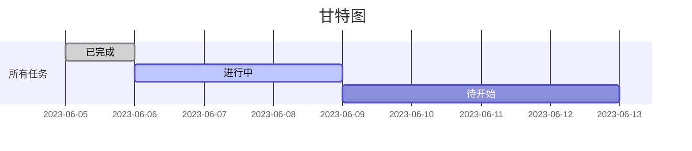
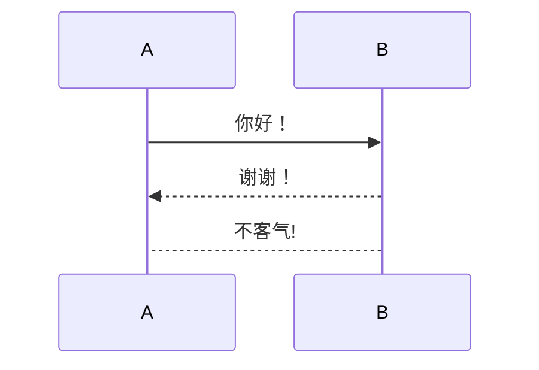
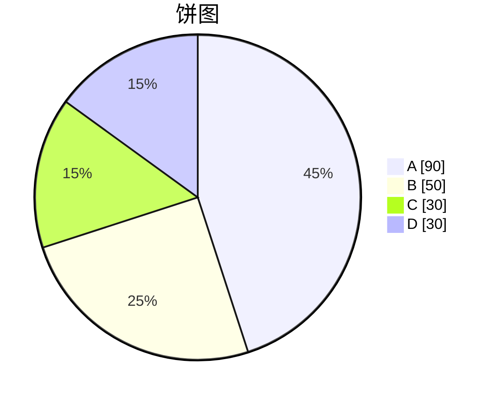
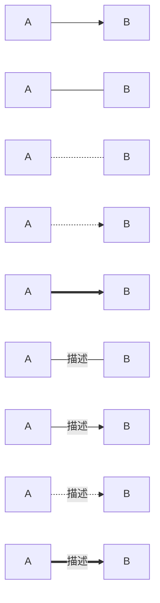

# 目录

<center></center>

# 一、前言

>本人大学才开始接触编程，自认为入门较晚。伴随着知识的积累，迫切需要一个知识输出是途径，个人博客无疑是首选，写博客离不开Markdown，我的第一篇博客就由此开始。

# 二、Markdown简介

<center></center>

## 1.定义

**Markdown是一种轻量级标记语言**

>通俗来讲就是一种轻排版，重内容的文档编写方法，简化版的word

## 2.优点

1. **轻量化**：Markdown文本编辑器占用的空间较小
2. **易读易写**：相比HTML，Markdown上手门槛更低，书写流畅也更易懂
3. **兼容性强**：世界上的主流的博客平台都能很好的支持Markdown

# 二、基础语法

## 1.标题

**说明**

文字前添加1~6个星号(#)，文本与#之间用空格隔开

**示例**

&emsp;文本：


&emsp;效果：


## 2.粗体

**说明**

两种方法

1. 在文字前后各加两个星号(*)
2. 在文字前后加各两条下划线(_)

**示例**

&emsp;文本：


&emsp;效果：

>**这是加粗**  __这也是加粗__

## 3.斜体

**说明**

在文字前后加一个星号(*)

**示例**

&emsp;文本：


&emsp;效果：

>*这是斜体*

## 4.加粗斜体

**说明**

在文字前后各加三个星号(*)

**示例**

&emsp;文本：


&emsp;效果：

>***这是倾斜加粗***

## 5.高亮

**说明**

在文字前后加两个等号(=)

**示例**

&emsp;文本：


&emsp;效果：

>==高亮==


## 6.删除线

**说明**

在文字前后加两条波浪线(~)

**示例**

&emsp;文本：


&emsp;效果：

>~~删除文本~~

## 7.下划线

**说明**

借助HTML语法，u标签

**示例**

&emsp;文本：


&emsp;效果：

><u>下划线</u>

## 8.图片

**说明**

有两种方法
1. 插入在线图片（推荐）：感叹号加方括号加圆括号，方括号内放名称，圆括号内放照片网址；
2. 插入本地图片（不推荐）：感叹号加方括号加圆括号，方括号内放名称，圆括号内放照片的本地路径

**示例**

&emsp;文本：


&emsp;效果：

>

>

## 9.表格

**说明**

表头间竖线隔开，表头与内容用减号隔开，减号左加冒号居左，减号右加冒号居右，减号两边加冒号居中

**示例**

&emsp;文本：


&emsp;效果：

>表头|表头|表头
>:-----|:-----:|-----:
>大致内容|大致内容|大致内容

## 10.分割线

**说明**

两种方法
1. 连续三个及以上的星号独占有一行
2. 连续三个及以上的减号独占有一行

>写分割线记得空出前面一行来

**示例**

&emsp;文本：


&emsp;效果：

>***
>---

## 11.引用

**说明**

在文字前加一个大于号(>)

**示例**

&emsp;文本：


&emsp;效果：

>这是引用

## 12.目录

**说明**

方括号加圆括号，方括号内填名称，圆括号内填想跳转的标题，只能跳转到标题处，标题内不要加空格

**示例**

&emsp;文本：


&emsp;效果：

[跳转到目录](#目录)

## 13.超链接

**说明**

方括号加圆括号，方括号内填名称，圆括号内填网址，也可加上双引号，内填注释

**示例**

&emsp;文本：


&emsp;效果：

>[bilibili](https://www.bilibili.com/ "哔哩哔哩")

## 14.代码

**说明**

文字前后加一个点（esc键下方那个），添加一行代码
文字前后加三个点（esc键下方那个），添加一个代码块

**示例**

&emsp;文本：


&emsp;效果：

`printf("hello world!");`

```
#include<stdio.h>
int main(){
printf("hello world!");
return 0;}
```

## 15.无序列表

**说明**

有三种方法
1. 文字前加加号和空格
2. 文字前加减号和空格
3. 文字前加星号和空格

**示例**

&emsp;文本：


&emsp;效果：

>+ 无序列表1
>+ 无序列表1
>- 无序列表2
>- 无序列表2
>* 无序列表3
>* 无序列表3

## 16.有序列表

**说明**

文字前加数字，点和空格

**示例**

&emsp;文本：


&emsp;效果：

>1. 有序列表
>2. 有序列表

## 17.任务列表

**说明**

有三种方法
文字前加减号，空格，方括号，方括号内填勾，叉或不填

**示例**

&emsp;文本：


&emsp;效果：

- [ ] 未完成
- [x] 已完成

## 18.注释

**说明**

文字前加方括号和冒号，方括号里加双斜线，注释的内容在正文中不显示

**示例**

&emsp;文本：


&emsp;效果：

>这是正文

[//]:这是注释

## 19.注脚

**说明**

文字后加方括号，方括号内放异或符号（shift+6）和数字；空一行后文字前加方括号和冒号，方括号内放异或符号（shift+6）和数字

**示例**

&emsp;文本：


&emsp;效果：

>这是正文内容[^1]

[^1]:这是注释内容

---
# 三、进阶语法（简要概括）

### 1.快捷键

**说明**

提供了一些快捷键

**示例**

&emsp;文本：


&emsp;效果：

撤销：<kbd>Ctrl/Command</kbd> + <kbd>Z</kbd>
重做：<kbd>Ctrl/Command</kbd> + <kbd>Y</kbd>
加粗：<kbd>Ctrl/Command</kbd> + <kbd>B</kbd>
斜体：<kbd>Ctrl/Command</kbd> + <kbd>I</kbd>
标题：<kbd>Ctrl/Command</kbd> + <kbd>Shift</kbd> + <kbd>H</kbd>
无序列表：<kbd>Ctrl/Command</kbd> + <kbd>Shift</kbd> + <kbd>U</kbd>
有序列表：<kbd>Ctrl/Command</kbd> + <kbd>Shift</kbd> + <kbd>O</kbd>
检查列表：<kbd>Ctrl/Command</kbd> + <kbd>Shift</kbd> + <kbd>C</kbd>
插入代码：<kbd>Ctrl/Command</kbd> + <kbd>Shift</kbd> + <kbd>K</kbd>
插入链接：<kbd>Ctrl/Command</kbd> + <kbd>Shift</kbd> + <kbd>L</kbd>
插入图片：<kbd>Ctrl/Command</kbd> + <kbd>Shift</kbd> + <kbd>G</kbd>
查找：<kbd>Ctrl/Command</kbd> + <kbd>F</kbd>
替换：<kbd>Ctrl/Command</kbd> + <kbd>G</kbd>

### 2.转义字符

**说明**

用于输出无法直接输出的字符

**示例**

&emsp;文本：


&emsp;效果：

>空格&nbsp;空格

### 3.数学公式

**说明**

涉及LaTex公式，以求极限举例

**示例**

&emsp;文本：


&emsp;效果：

$$
 \lim_{x \to 0} \frac {3x ^2 +7x^3} {x^2 +5x^4} = 3
$$

### 4.甘特图

**说明**

通过条状图来显示项目、进度和其他时间相关的系统进展的内在关系随着时间进展的情况

**示例**

&emsp;文本：


&emsp;效果：



### 5.流程图

**说明**

Markdown也可以用来画流程图，但是不建议，建议用其他软件画图

**示例**

&emsp;文本：


&emsp;效果：








# 四、总结

## 参考文献

[【高效工具】《三》Typora直接使用MarkDown语法绘制流程图、时序图、甘特图_黑白猿的博客-CSDN博客](https://blog.csdn.net/gavinbj/article/details/104903318)

[markdown 中流程图详解_markdown流程图_放羊郎的博客-CSDN博客](https://blog.csdn.net/suoxd123/article/details/84992282)